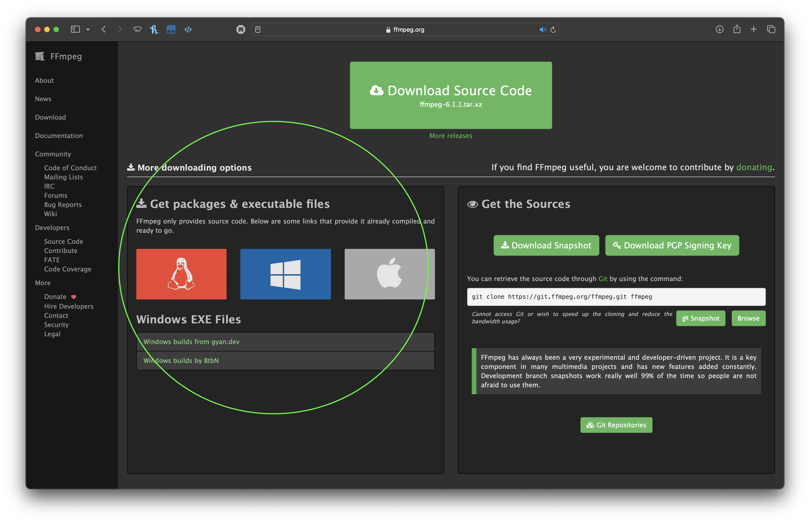

# Stonkedd's Video Downloader
Video downloader for all my editing goats. Currently supports:
- YouTube

## How to Install
1. Download any version of Python > 3.7: https://www.python.org/downloads/
2. Download PyInstaller: https://pyinstaller.org/en/stable/installation.html
3. Download this (top right corner)
4. Right click the unzipped folder, and select "Open with terminal"
5. Run this command: ```pyinstaller main.py```
6. Copy ```dratini.ico``` into the created ```dist``` folder

or ask me 

## YouTube
Provide a URL, a save location, and whether you want the .mp4 or the .mp3. The file will have the same name as the video.

## MP3 Troubleshooting
If MP3 files fails to convert properly, you probably need this installed: https://ffmpeg.org/download.html

To use this, download from packages & executable files, and move that to your home directory.
