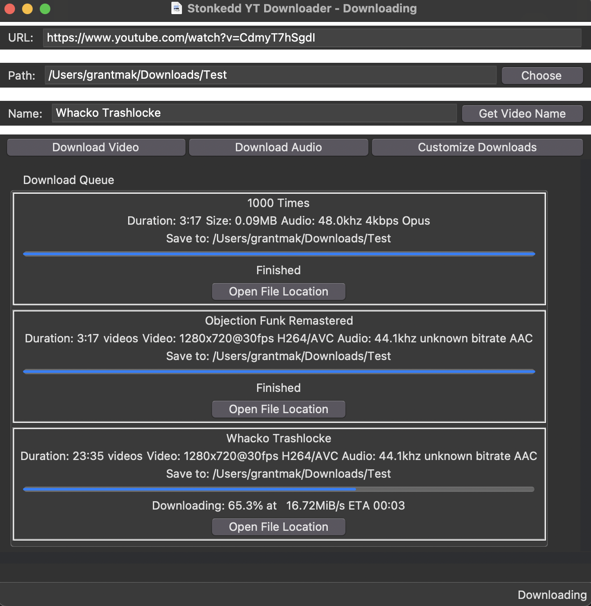
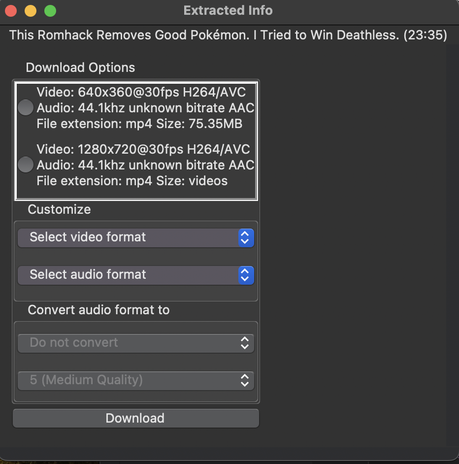

# Stonkedd's Video Downloader
Video downloader for all my editing goats. Current features:
- Download in .mp4 or .mp3
- Download in multiple qualities  
- Queue multiple videos for download
- Progress bars on downloads
- Specify a download location, and an option to open that location later
- Specify names of files, and an option to grab the default video name
- Download a playlist by supplying the playlist link (not an invididual video)
- Verification with browser to download private / restricted videos!





Currently supports:
- YouTube

To run it, just download the dist file for your OS and run `main`. If you want to build it yourself for some reason, you can follow the directions below.

## How to Install
1. Download any version of Python > 3.9: https://www.python.org/downloads/
2. Download PyInstaller: https://pyinstaller.org/en/stable/installation.html
3. Download this (top right corner)
4. Right click the unzipped folder, and select "Open with terminal"
5. Run this command: ```pyinstaller main.py```
6. Copy ```dratini.ico``` into the created ```dist``` folder

## YouTube
Provide a URL, a save location, and whether you want the .mp4 or the .mp3. The file will have the same name as the video.

## MP3 Troubleshooting
If MP3 files fails to convert properly, you probably need this installed: https://ffmpeg.org/download.html

To use this, download from packages & executable files, and move that to your home directory.

I recommend using the first option. To do so:
1. Follow the instructions here to install chocolatey: https://chocolatey.org/install 
    - Or just run 
        ```
        Set-ExecutionPolicy Bypass -Scope Process -Force; [System.Net.ServicePointManager]::SecurityProtocol = [System.Net.ServicePointManager]::SecurityProtocol -bor 3072; iex ((New-Object System.Net.WebClient).DownloadString('https://community.chocolatey.org/install.ps1'))
        ```
    in an administrative shell (Search for PowerShell, Right-Click and Open as Admin)
2. Once that is set, you can run:
    ```
    choco install ffmpeg
    ```
